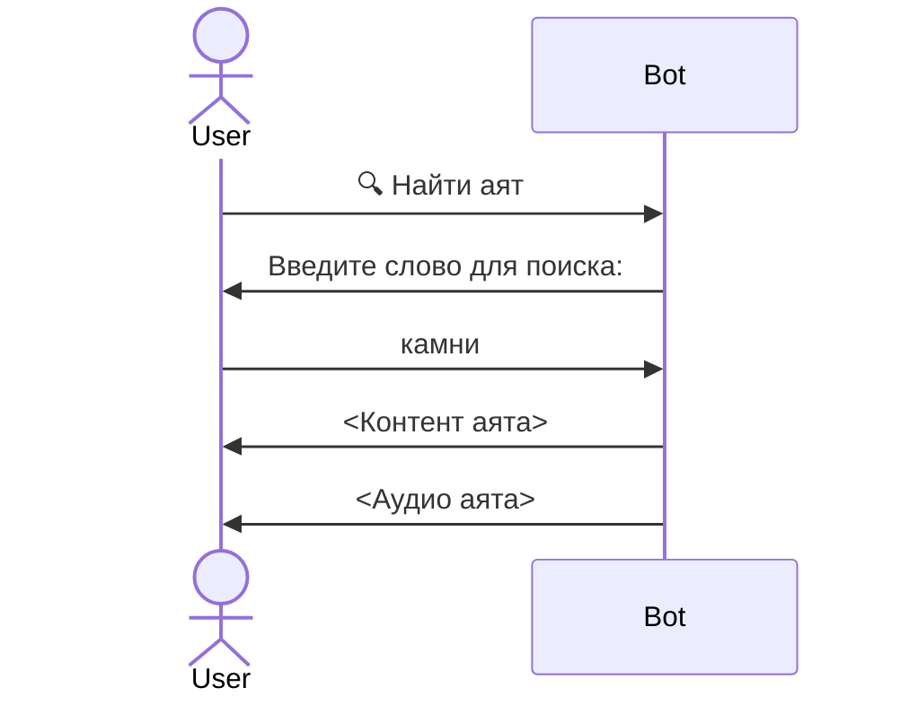

# Требования к работе с аятами

## Получить аяты по номеру суры и аята

Когда пользователь отправляет сообщение `5:4`, ему должно возвращаться [Сообщение с аятом](glossary.md#Сообщение-с-аятом):

#### Пример отправляемого текста:
Пример клавиатуры:

Если это первый аят, клавиатура будет выглядеть следующим образом:

<table>
    <tbody>
        <tr>
            <td>2:1-5 ➡️</td>
        </tr>
        <tr>
            <td>Добавить в избранное</td>
        </tr>
    </tbody>
</table>

Последний аят:

<table>
    <tbody>
        <tr>
            <td>⬅️ 2:1-5</td>
        </tr>
        <tr>
            <td>Добавить в избранное</td>
        </tr>
    </tbody>
</table>

Если аят уже в избранном текст кнопки "Добавить в избранное" меняется на "Удалить из избранного"

<table>
    <tbody>
        <tr>
            <td>⬅️ 5:3</td>
            <td>5:5 ➡️</td>
        </tr>
        <tr>
            <td colspan="2">Удалить из избранного</td>
        </tr>
    </tbody>
</table>

## Поиск по содержимому аятов:

Пользователь нажимает на кнопку "🔍 Найти аят", и переходит в режим поиска аята: следующие текстовые сообщения считаются запросом для поиска по контенту аятов.

Пример диалога:

Пагинация в клавиатуре происходит по результатам поиска

## Избранные аяты:

Если пользователь нажимает на кнопку или отправляет сообщение "Избранные аяты", ему возвращается [Сообщение с аятом](glossary.md#Сообщение-с-аятом) и клавиатура с пагинацией по избранным

Если пользователь нажимает на кнопку "Добавить в избранное", то аят помещается в ["избранные аяты"](glossary.md#Избранные-аяты) этого пользователя

Если пользователь нажимает на кнопку "Удалить из избранного", то аят удаляется из ["избранных аятов"](glossary.md#Избранные-аяты) этого пользователя

## Создание аятов:

Аят создается единожды.

Информация об аяте парсится с сайта https://umma.ru/perevod-korana/

## Обновление аятов:

При обновлении содержимого аята на сайте https://umma.ru/perevod-korana/, данные в базе об этом аяте должны обновиться
