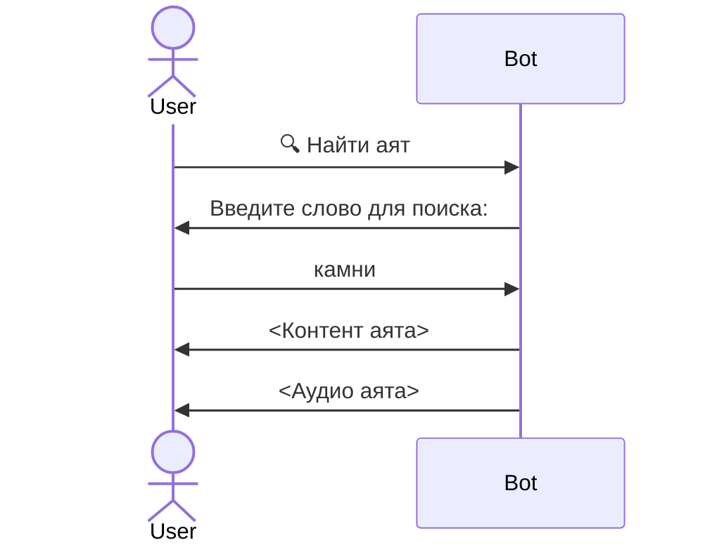

# Требования к работе с аятами

## Получить аяты по номеру суры и аята

Когда пользователь отправляет сообщение `5:4`, ему должен возвращаться:

 - номер суры аята со ссылкой на источник (ссылка)
 - аят на арабском
 - перевод на русский
 - транслитерация
 - клавиатура, содержащая кнопки для пагинации по аятам и добавления/удаления аята в избранное
 - аудио аята на арабском

#### Пример отправляемого текста:

> [5:4)](https://umma.ru/sura-5-al-maida-trapeza/)
>
 >َلَّمْتُمْ مِنَ الْجَوَارِحِ مُكَلِّبِينَ تُعَلِّمُونَهُنَّ مِمَّا عَلَّمَكُمُ اللَّهُ فَكُلُوا مِمَّا أَمْسَكْنَ عَلَيْكُمْ وَاذْكُرُوا اسْمَ اللَّهِ عَلَيْهِ وَاتَّقُوا اللَّهَ إِنَّ اللَّهَ سَرِيعُ الْحِسَابِ 
> 
> У тебя [Мухаммад] спрашивают о разрешенном для них [для верующих]. Скажи: «Разрешено вам все хорошее [приятное с точки зрения здорового общечеловеческого восприятия. Все незапрещенное — изначально дозволено]. Вам разрешается использовать обученных животных и птиц для охоты. Ешьте добычу, что они удерживают [приносят] для вас. А отправляя их за нею, упоминайте имя Аллаха (Бога, Господа).Бойтесь Аллаха (Бога, Господа). Воистину, Он быстро отчитает [человека в Судный День за дела мирские и поступки (быстро подведет итог его мирского бытия). Долгие разбирательства не потребуются, результат мирских деяний человека будет нагляден и очевиден]. 
> 
> [Йас\`алюнака Маза Ухилля Ляхум Куль Ухилля Лякумут-Таййибату Уа Ма \`Аллzмтум Миналь-Джаварихи Мукаллибина Ту\`аллимунахунна Мимма \`АллямакумуЛлаху Факулю Мимма Амсакна \`Алейкум Уа Аpкуру АсмаЛлахи \`Алейхи УаТтакуЛлаха ИннаЛлаха Сари`уль-Хисааб.]

Пример клавиатуры:

<table>
    <tbody>
        <tr>
            <td>⬅️ 5:3</td>
            <td>5:5 ➡️</td>
        </tr>
        <tr>
            <td colspan="2">Добавить в избранное</td>
        </tr>
    </tbody>
</table>

Если это первый аят, клавиатура будет выглядеть следующим образом:

<table>
    <tbody>
        <tr>
            <td>2:1-5 ➡️</td>
        </tr>
        <tr>
            <td>Добавить в избранное</td>
        </tr>
    </tbody>
</table>

Последний аят:

<table>
    <tbody>
        <tr>
            <td>⬅️ 2:1-5</td>
        </tr>
        <tr>
            <td>Добавить в избранное</td>
        </tr>
    </tbody>
</table>

Если аят уже в избранном текст кнопки "Добавить в избранное" меняется на "Удалить из избранного"

<table>
    <tbody>
        <tr>
            <td>⬅️ 5:3</td>
            <td>5:5 ➡️</td>
        </tr>
        <tr>
            <td colspan="2">Удалить из избранного</td>
        </tr>
    </tbody>
</table>

## Поиск по содержимому аятов:

Пользователь нажимает на кнопку "🔍 Найти аят", и переходит в режим поиска аята: следующие текстовые сообщения считаются запросом для поиска по контенту аятов.

Пример диалога:

Пагинация в клавиатуре происходит по результатам поиска
