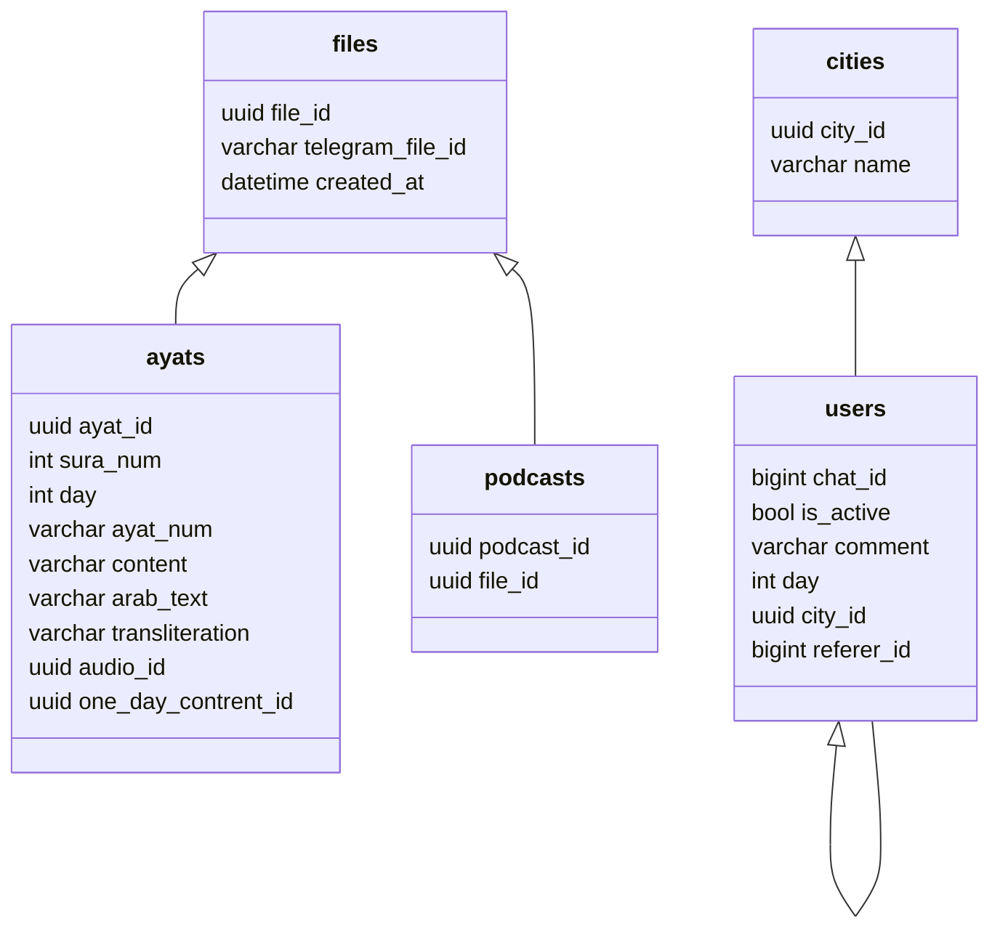

# Схема базы данных

```mermaid
classDiagram
    files <|-- ayats
    files <|-- podcasts
    users <|-- users
    cities <|-- users
    class ayats{
        uuid ayat_id
        int sura_num
        int day
        varchar ayat_num
        varchar content
        varchar arab_text
        varchar transliteration
        uuid audio_id
        uuid one_day_contrent_id
    }
    class files{
        uuid file_id
        varchar telegram_file_id
        datetime created_at
    }
    class users{
        bigint chat_id
        bool is_active
        varchar comment
        int day
        uuid city_id
        bigint referer_id
    }
    class cities{
        uuid city_id
        varchar name
    }
    class podcasts{
        uuid podcast_id
        uuid file_id
    }
```
