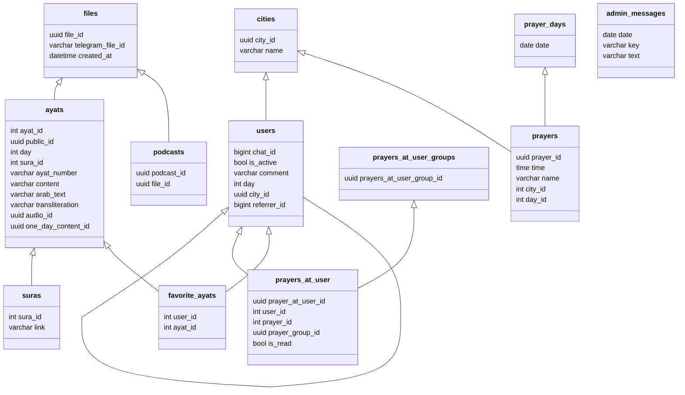
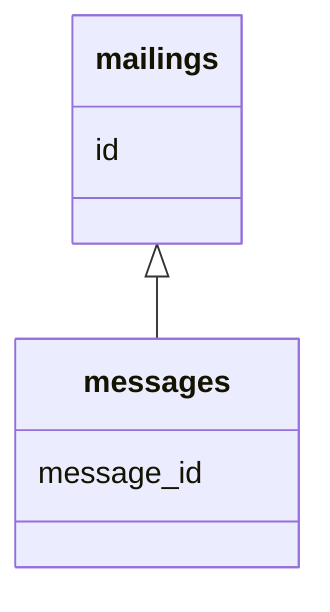
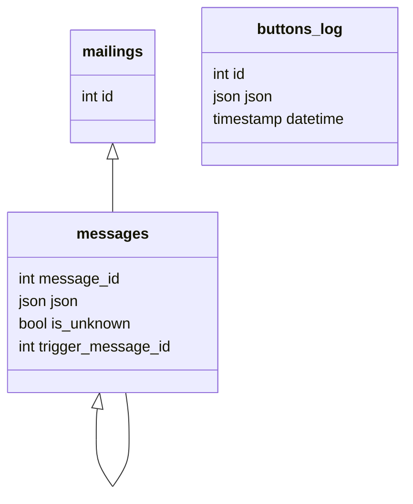

# Схема базы данных

Схема приложения с ботом:

```mermaid
classDiagram
    files <|-- ayats
    files <|-- podcasts
    users <|-- users
    ayats <|-- suras
    cities <|-- users
    users <|-- prayers_at_user
    prayers_at_user_groups <|-- prayers_at_user
    cities <|-- prayers
    prayer_days <|-- prayers
    users <|-- favorite_ayats
    ayats <|-- favorite_ayats
    class ayats{
        int ayat_id
        uuid public_id
        int day
        int sura_id
        varchar ayat_number
        varchar content
        varchar arab_text
        varchar transliteration
        uuid audio_id
        uuid one_day_content_id
    }
    class favorite_ayats{
        int user_id
        int ayat_id
    }
    class suras{
        int sura_id
        varchar link
    }
    class files{
        uuid file_id
        varchar telegram_file_id
        datetime created_at
    }
    class users{
        bigint chat_id
        bool is_active
        varchar comment
        int day
        uuid city_id
        bigint referrer_id
    }
    class cities{
        uuid city_id
        varchar name
    }
    class podcasts{
        uuid podcast_id
        uuid file_id
    }
    class prayers{
        uuid prayer_id
        time time
        varchar name
        int city_id
        int day_id
    }
    class prayers_at_user{
        uuid prayer_at_user_id
        int user_id
        int prayer_id
        uuid prayer_group_id
        bool is_read
    }
    class prayers_at_user_groups{
        uuid prayers_at_user_group_id
    }
    class prayer_days{
        date date
    }
    class admin_messages{
        date date
        varchar key
        varchar text
    }
```

Схема приложения с API:

```mermaid
classDiagram
    mailings <|-- messages
    class messages{
        message_id
    }
    class mailings{
        id
    }
```

Схема приложения с API:

```mermaid
classDiagram
    mailings <|-- messages
    messages <|-- messages
    class messages{
        int message_id
        json json
        bool is_unknown
        int trigger_message_id
    }
    class mailings{
        int id
    }
    class buttons_log{
        int id
        json json
        timestamp datetime
    }
```