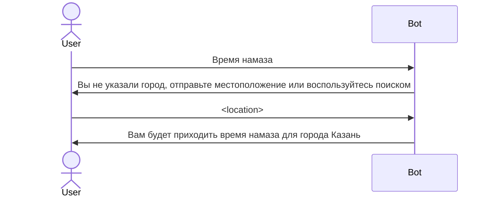
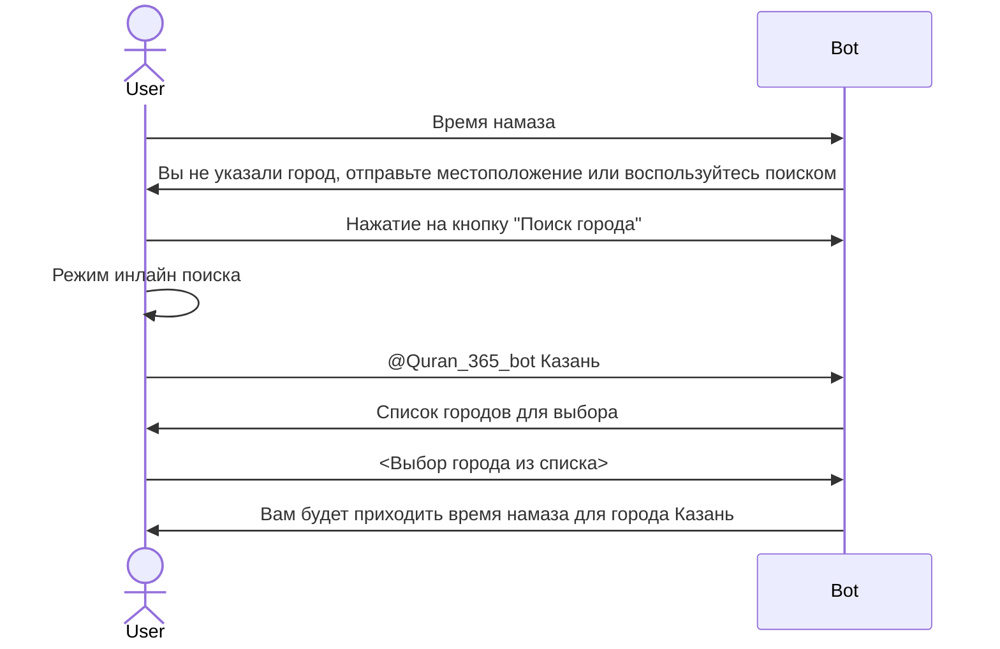

<!---
SPDX-FileCopyrightText: Copyright (c) 2018-2026 Almaz Ilaletdinov <a.ilaletdinov@yandex.ru>
SPDX-License-Identifier: MIT
-->
<!--
# TODO #1428:30min Описать парсеры для https://namaz.today
# TODO #1672:30min Описать парсеры для https://halalguide.me
-->
# Требования к разделу "Время намаза"

При отправке сообщения "Время намаза" пользователь должен получить сообщение с [временем намаза](glossary.md#Сообщение-с-временем-намаза)

Если у пользователя не установлен город, то ему должно вернуться [сообщение с предложением выбрать город](glossary.md#Сообщение-с-предложением-выбрать-город)

Пользователь может отправить свое местоположение и по координатам ему присвоится город

Пример диалога с отправкой местоположения:

Пример диалога с отправкой местоположения:

## Клавиатура сообщения с временем намаза

В некоторых случаях необходимо просмотреть время намаза за вчерашний день
(например, чтобы посмотреть время ночного намаза за вчерашний день в 01:00 ночи).

Для этого есть 2 кнопки, при помощи которых можно получить время намаза за предыдущий и следующий день

<table>
    <tbody>
        <tr>
            <td>❌</td>
            <td>❌</td>
            <td>❌</td>
            <td>❌</td>
            <td>❌</td>
        </tr>
        <tr>
            <td colspan="2"><- 01.09</td>
            <td colspan="3">03.09 -></td>
        </tr>
    </tbody>
</table>

При нажатии на кнопку статус меняется на противоположный

<table>
    <tbody>
        <tr>
            <td>✅</td>
            <td>✅</td>
            <td>✅</td>
            <td>✅</td>
            <td>✅</td>
        </tr>
        <tr>
            <td colspan="2"><- 01.09</td>
            <td colspan="3">03.09 -></td>
        </tr>
    </tbody>
</table>

## Просмотр времени намаза на определенную дату

При отправке сообщения "Время намаза 12.03.2020" пользователю возвращается время намаза для 12 апреля 2020 года.

Допустимые форматы:
- 12.03.2020
- 12-03-2020

## Заполнение таблиц с ссылками на времена намаза

<!--
# TODO #1686:30min Описать процесс
-->
...
