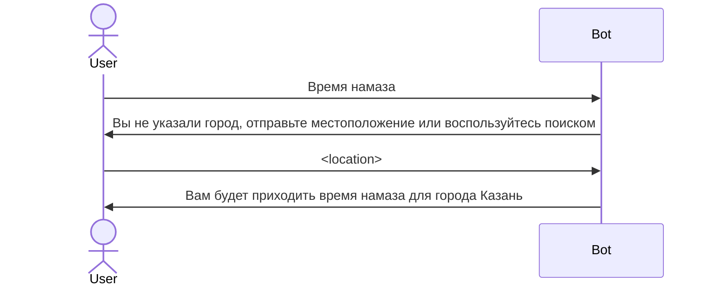
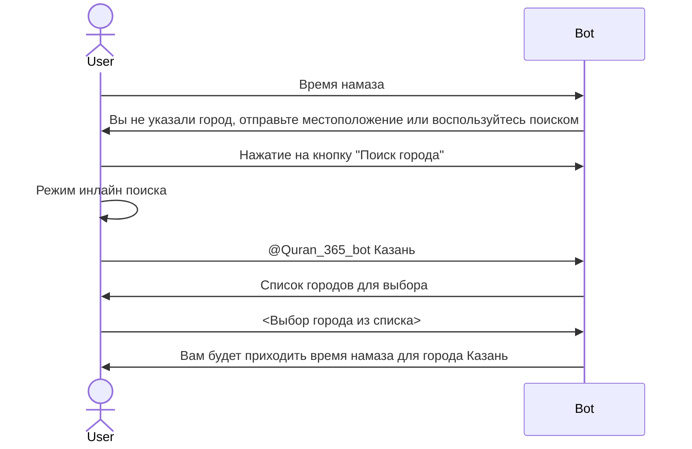

<!---
The MIT License (MIT).

Copyright (c) 2018-2024 Almaz Ilaletdinov <a.ilaletdinov@yandex.ru>

Permission is hereby granted, free of charge, to any person obtaining a copy
of this software and associated documentation files (the "Software"), to deal
in the Software without restriction, including without limitation the rights
to use, copy, modify, merge, publish, distribute, sublicense, and/or sell
copies of the Software, and to permit persons to whom the Software is
furnished to do so, subject to the following conditions:

The above copyright notice and this permission notice shall be included in all
copies or substantial portions of the Software.

THE SOFTWARE IS PROVIDED "AS IS", WITHOUT WARRANTY OF ANY KIND,
EXPRESS OR IMPLIED, INCLUDING BUT NOT LIMITED TO THE WARRANTIES OF
MERCHANTABILITY, FITNESS FOR A PARTICULAR PURPOSE AND NONINFRINGEMENT.
IN NO EVENT SHALL THE AUTHORS OR COPYRIGHT HOLDERS BE LIABLE FOR ANY CLAIM,
DAMAGES OR OTHER LIABILITY, WHETHER IN AN ACTION OF CONTRACT, TORT OR
OTHERWISE, ARISING FROM, OUT OF OR IN CONNECTION WITH THE SOFTWARE OR THE USE
OR OTHER DEALINGS IN THE SOFTWARE.
-->
# Требования к разделу "Время намаза"

При отправке сообщения "Время намаза" пользователь должен получить сообщение с [временем намаза](glossary.md#Сообщение-с-временем-намаза)

Если у пользователя не установлен город, то ему должно вернуться [сообщение с предложением выбрать город](glossary.md#Сообщение-с-предложением-выбрать-город)

Пользователь может отправить свое местоположение и по координатам ему присвоится город

Пример диалога с отправкой местоположения:

Пример диалога с отправкой местоположения:

## Клавиатура сообщения с временем намаза

| ❌   | ❌   | ❌   | ❌   | ❌   |
|-----|-----|-----|-----|-----|

При нажатии на кнопку статус прочитанности меняется на противоположный

| ✅   | ✅   | ✅   | ✅   | ✅   |
|-----|-----|-----|-----|-----|

## Просмотр времени намаза на определенную дату

При отправке сообщения "Время намаза 12.03.2020" пользователю возвращается время намаза для 12 апреля 2020 года.

Допустимые форматы:
- 12.03.2020
- 12-03-2020
