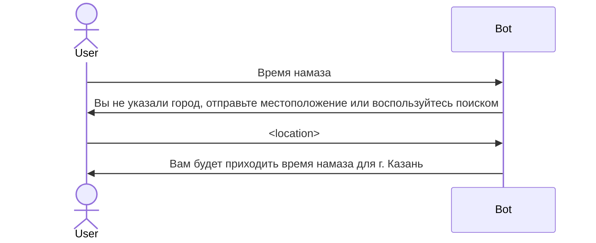
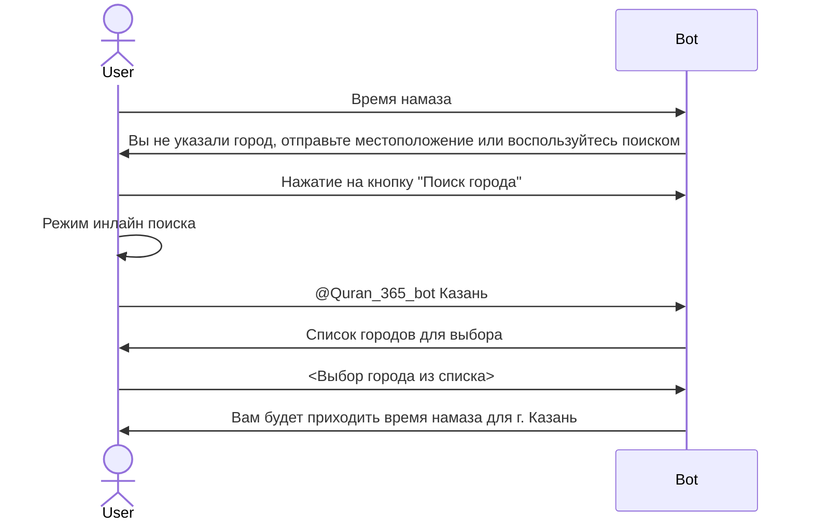

# Требования к разделу "Время намаза"

При отправке сообщения "Время намаза" пользователь должен получить сообщение с [временем намаза](glossary.md#Сообщение-с-временем-намаза)

Если у пользователя не установлен город, то ему должно вернуться [сообщение с предложением выбрать город](glossary.md#Сообщение-с-предложением-выбрать-город)

Пользователь может отправить свое местоположение и по координатам ему присвоится город

Пример диалога с отправкой местоположения:

Пример диалога с отправкой местоположения:

