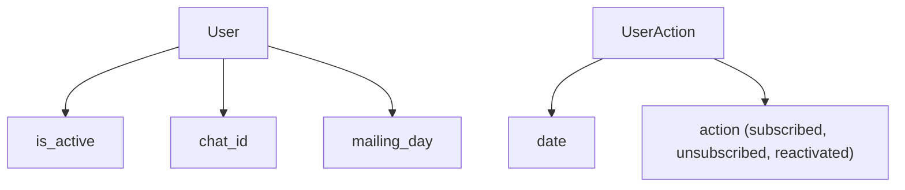

# Процесс регистрации

Пользователь отправляет сообщение `/start`, далее обработка идет по 3 сценариям:

1) Это новый пользователь [подробности](#Регистрация-нового-пользователя)
2) Этот пользователь уже зарегистрирован и активен
3) Пользователь уже есть в базе, но он был отписан на момент отправки команды `/start`

Если пользователь регистрируется, деактивируется или реактивируется, то нужно логгировать это действие в БД для статистики.

При регистрации пользователя нужно сохранить его идентификатор чата.



## Регистрация нового пользователя

Event storming:

```
Command: User subscription
Actor: User
Event: UserSubscribed
```

```
Command: User unsubscribed
Actor: User
Event: UserUnsubscribed
```

```
Command: User reactivated
Actor: User
Event: UserReactivated
```
